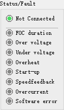

# 硬石电子-FOC5.4.3测试工具

# 使用说明

***

技术论坛 ：[**www.ing10bbs.com**](http://www.ing10bbs.com)

电   话：020-29814159

QQ：2536843366

QQ交流群：515110016（硬石电子交流群）

旺   旺：硬石电子

***

 

版本历史

| 版本 | 发布时间  | 修改内容         | 作者 |
| ---- | --------- | ---------------- | ---- |
| v1.0 | 2020-3-09 | 新建文件         | 硬石 |
| v1.1 | 2020-5-09 | 添加参数曲线显示 | 硬石 |

***

## 关于本文档几点说明

1.  本文档仅适用于解释“硬石电子-FOC5.4.3测试工具”使用方法，以下简称上位机。

2.  实际使用时需要YS-F4Pro或YS-F1Pro和无刷电机套件配合使用。

3.  在使用前需要安装USB-RS232驱动，请先安装USB转串口驱动。

4.  该软件仅适合具有一定基础及能够阅读FOC源码的技术人员使用，部分功能要求能理解st MC SDK Workbench的通信协议。

5.  如遇到软件bug或者有功能建议，可以到https://github.com/Ging-H/MC-Test提交issues。

**开发板资料更新链接：**

[**硬石电子**](http://www.ing10bbs.com)

**淘宝店铺：**

[**硬石电子**](https://shop149744403.taobao.com/) 

****

###  1 连接设备

* 选择正确的端口号，默认的波特率为115200、数据位为8bit、校验位为NoParity，停止位为1。

* 连接了控制板之后没有出现对应的端口号，可以点击***刷新\***按钮刷新端口号。

* 点击***打开串口\***。

* *端口号是连接了控制设备的通信端口，具体端口可以从设备管理器当中找到。连接设备之前，* *需要先在开发板烧录FOC5.4.3**的程序。*

### 2 运行状态

* 最上方表示电机运行状态，也就是状态机的状态。

* 下方的是电机的错误状态，如果出现错误则亮红色，如果错误没有被解除就亮黄色，错误已经解除就亮灰色。

### 3 基础控制

​                               

* **复位：** 这个功能需要修改源码才能实现。在user_interface.c文件中的739行（不同的源码可能是其他的行数，但一定会在这个文件当中），找到switch语句的分支case MC_PROTOCOL_CMD_RESET：然后添加HAL_NVIC_SystemReset()函数 ，就可以实现复位的功能。发送该指令不会有任何反馈。

* **启动：** 启动电机转动，前提是需要给电机合适的目标参数。

* **停止：** 停止电机转动。

* **启动/停止：** 点击一次就启动，再次点击就是停止。

* ** Stop Ramp：** 停止Ramp的动作。

* ** 校准对齐：** 专用于编码器模式，可以出发电机校准对齐。

* ** Fault Ack：** 应答错误，当出现错误并且已经排除错误的时候，就可以点击应答排除错误状态。

* ** Speed/Torque：** 控制模式选择，可选速度模式或者扭矩模式。

### 4 位置控制

*  **Kp、Ki、Kd：**这是位置模式的PID参数，取值范围是0~65535。

* **目标值：**电机转动的圈数，可以是浮点数。

* **周期：** 如果是0，则表示以following模式运行，则电机以全速达到目标值；如果不为0，则是以movement模式运行，也就是S型加减速模式。单位是s。

* **Ramp：**发送目标值和周期值。如果多次发送周期为0的Ramp指令，则会有不同的效果，具体需要阅读源码理解。

*  **位置显示：**显示当前转动的圈数。

### 5 速度控制

* **Kp、Ki：**速度控制的PID参数，取值范围是0~65535。

*  **Spd：**单独设置电机的目标转速，单位是RPM。

*  **目标值：**电机转速的目标值，单位是RPM。

*  **周期：**电机达到目标值所需要的时间。单位是ms。

*  **Ramp：**发送目标值和周期，执行Ramp指令。

*  **电机转速：**显示当前电机的转速。

### 6 电流控制

* **Iq Kp、Iq Ki：**电流（Torque）控制的PID参数，取值范围是0~65535。

* **Id Kp*、Id Ki：**电流（Flux）控制的PID参数，取值范围是0~65535。

* **Ref：**电流Iq，Id的目标值，格式是s16A。

* **Torque（Iq）：**Torque的测量值，格式是s16A。

* **Flux（Id）：**Flux的测量值，格式是s16A。

### 7 指令通用发送功能

* **电机_默认：**选择控制的电机。

* **FrameID：**数据帧的ID。

* **REG_TARGET_MOTOR/CMD：**寄存器/指令。根据FrameID决定，只能二选一。

* **可编辑文本框：**payload，只能输入十六进制字符，是实际的数据，可以为空。

* **不可编辑文本框：**用于显示反馈数据。

* **发送：**发送一帧数据。

* *这是所有指令的通用发送功能。可通过鼠标操作选择指令发送。*

### 8 Log显示

*  **Log：**记录每一个操作的通信状态。

### 9 曲线显示

* **打开曲线显示窗口：**在菜单栏选择曲线，然后点击打开参数曲线窗口。

* **保存：**会弹出保存文件对话框，选择路径并输入文件名字之后，点击保存，即可将当前的曲线图像保存到电脑当中。

* **暂停绘图/继续绘图：**可以暂停/恢复更新曲线。

* **清空数据：**清空所有曲线的数据点，并且将绘图区的中心调整为坐标原点。

* **选框放大/鼠标拖动：**可以点击鼠标左键，然后拖动鼠标，松开鼠标之后会将所选择的区域放大到绘图区中心显示。再次点击该工具之后点击鼠标左键并拖动，将会拖动整个绘图区图像。

* **绘图区：**是曲线显示区域，绘图区可以显示两条曲线，一条是速度曲线，一条是位置曲线。对应的左侧坐标轴是速度值，右侧坐标轴是位置值。所有的坐标轴都可以单独使用鼠标滚轮进行放大缩小，同时也可以在绘图区使用鼠标滚轮同时对所有坐标轴进行缩放。

### 10 风格主题

* **主题风格：**在菜单栏点击帮助，然后选择风格主题，可选Black和Original两种主题风格。
